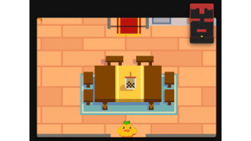
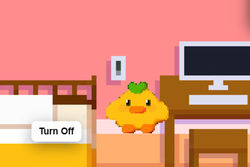

# Chip's House – *"A Little Surprise in the Room"*

> *A cozy little hand-drawn minigame created as a surprise birthday gift — now evolving into a full interactive world.*

---

## About the Game

This project started as a **birthday surprise** for a dear friend.  
It’s a **2D hand-drawn animation-based mini adventure** set in a warm, quiet bedroom.

You can **move the character** around, **interact with the environment**, and even discover a few secrets hidden in plain sight...

> 💡 *Hint: Try clicking the light switch near the bed. There might be a hidden button there!*
> 

---

## Features

- **Playable character movement**  
  Smooth movement and responsive controls.
- **Hand-drawn art & animation**  
  All sprites and backgrounds are fully illustrated by hand.
- **Hidden birthday surprise**  
  A short message or event will trigger once you find the secret.
- **Expandable gameplay system**  
  The foundation for future updates — more objects, dialogue, and story interactions coming soon!

---

## Built With

| Component | Description |
|------------|-------------|
| **Languages** | HTML, CSS, JavaScript (Vanilla) |
| **Frameworks** | None (pure JS for simplicity) |
| **Tools** | Procreate for pixel and hand-drawn animation |
| **Game Loop** | Custom rendering loop with `requestAnimationFrame()` |
| **Audio** | Web Audio API |

---

## Future Plans

Due to the **time-consuming nature of the art and animation**, development will continue gradually.

**Planned features:**
- Dialogue system & story interactions  
- Expandable environment (more rooms!)  
- Simple interactive objects  
- Original soundtrack  

---

## Personal Note

This project is a labor of love — a small world drawn by hand to celebrate someone special, now growing into something bigger.  
If you enjoyed it or want to follow the updates, feel free to ⭐ the repo or leave feedback!

---

## Project Structure

